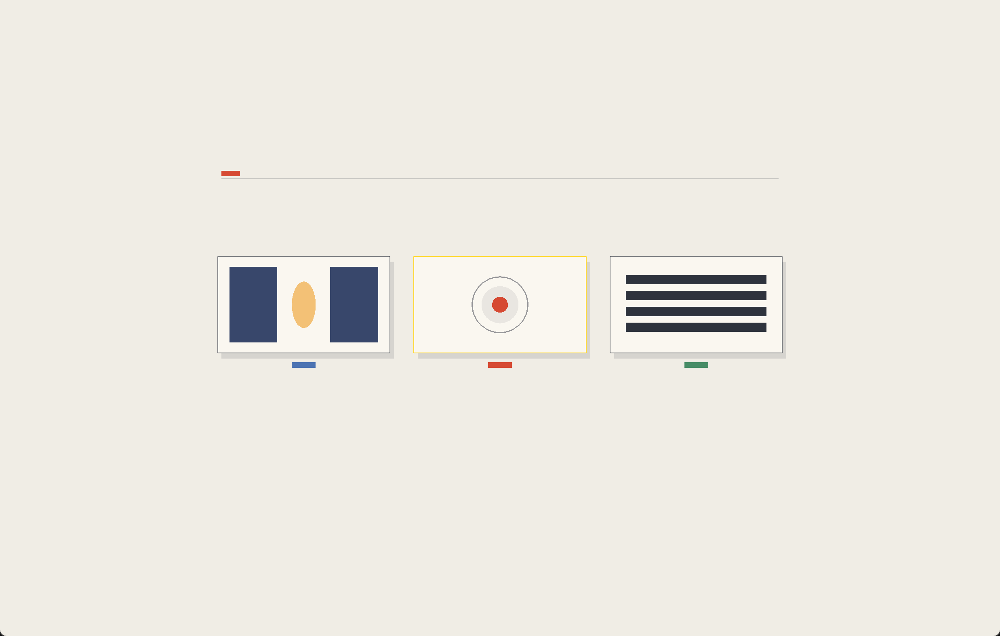

# rigProject



Document/page POD + JSON load/save (`.rig` by default). Depends on rigComponent for registration order.

## Serialize

- Root shape: `{ "Project": {...}, "entities": [...] }`
- Core codecs: Page, Transform, Shape, Mesh, DrawStyle, Relationship, Guide
- Skips: Selection (session), Canvas/Texture (non-portable), document metadata entity in `entities[]`
- Packs can `registerSerializer` / set root extension writer/reader for domain envelopes

### File extension

Default is **`.rig`**. Apps can switch without changing the JSON shape:

```cpp
doc->setFileExtension("rig");     // default
doc->setFileExtension("rigdoc");  // longer form
doc->requestSave(doc->documentPath(AppPaths::getDataDir() + "/show"));
doc->requestLoad(AppPaths::getDataDir() + "/show"); // appends preferred ext if missing
```

Paths that already include a suffix (`.rig`, `.rigdoc`, `.json`, etc.) are left alone.

## Build Example

```bash
cmake -S examples/document -B examples/document/build
cmake --build examples/document/build --target document
```

[API/docs](https://rigkid.github.io/rigProject/)
